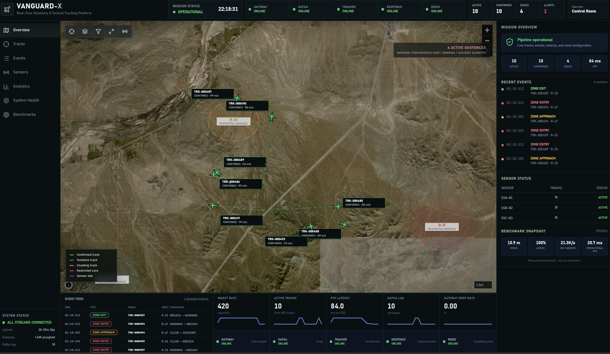
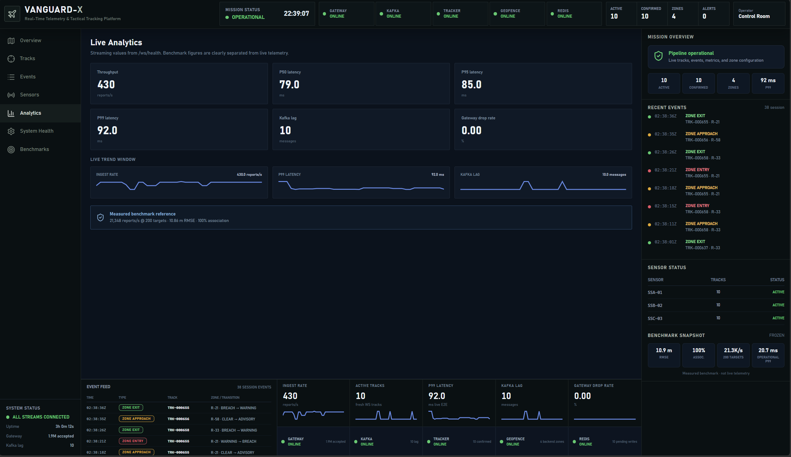
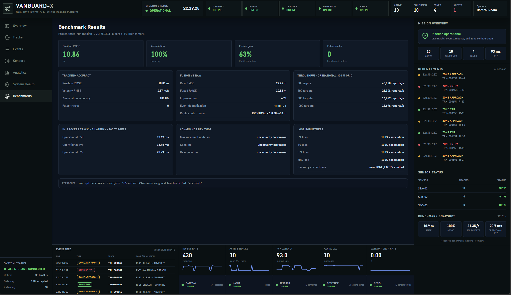
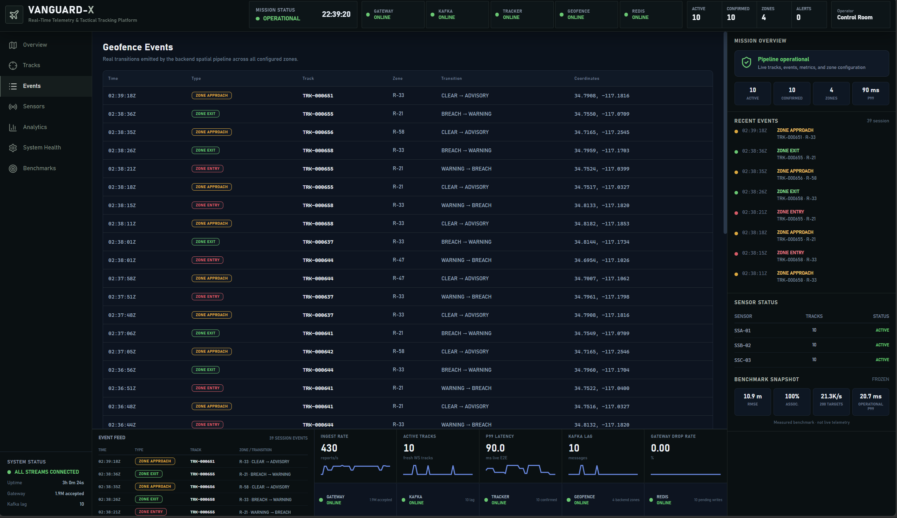

<h1 align="center">V A N G U A R D - X</h1>

<p align="center">
  <strong>Three imperfect sensors observe the same airspace and disagree.</strong><br>
Vanguard fuses asynchronous, noisy range/bearing reports into a single track picture, raises stateful geofence events, and preserves track identity through missed detections and replayable Kafka boundaries.</p>

<p align="center">
  <a href="https://github.com/cybr-wisp/vanguard-x/actions/workflows/ci.yml"></a>
  
  
  
  
  
  
  
  <a href="LICENSE"></a>
</p>

<p align="center">
  
</p>

> **Scope:** Vanguard-X is an educational, simulated, unclassified software project. Sensors, trajectories, measurements, and geofences are synthetic. It is not an operational combat, targeting, or weapon-control system.

---
 
### Contents
 
- [01. Measured results](#01-measured-results)
- [02. Architecture](#02-architecture)
  - [Simulation](#simulation)
  - [Operator UI](#operator-ui)
- [03. How sensor fusion works](#03-how-sensor-fusion-works)
- [04. Track lifecycle and uncertainty](#04-track-lifecycle-and-uncertainty)
- [05. Failure modes and recovery evidence](#05-failure-modes-and-recovery-evidence)
- [06. Requirements traceability](#06-requirements-traceability)
- [07. Sensor interface](#07-sensor-interface)
- [08. Module map](#08-module-map)
- [09. Benchmark methodology](#09-benchmark-methodology)
- [10. Verification and CI](#10-verification-and-ci)
- [11. Observability](#11-observability)
- [12. Documentation](#12-documentation)
- [13. Known limitations](#13-known-limitations)
- [14. Quick start](#14-quick-start)
- [15. License](#15-license)
---
 
### 01. Measured results
 
All values below are from the frozen benchmark campaign with a fixed workload, fixed configuration, and committed raw outputs.
 
| Category | Metric | Result |
|---|---|---:|
| Tracking | Position RMSE | **10.86 m** |
| Tracking | Velocity RMSE | **4.17 m/s** |
| Tracking | Association accuracy | **100.0%** |
| Tracking | False tracks | **0** |
| Fusion | Raw observation RMSE | **29.24 m** |
| Fusion | Fused position RMSE | **10.82 m** |
| Fusion | RMSE reduction | **63.0%** |
| Throughput | 50 concurrent targets | **48,858 reports/s** |
| Throughput | 200 concurrent targets | **21,348 reports/s** |
| Throughput | 500 concurrent targets | **14,962 reports/s** |
| Throughput | 1,000 concurrent targets | **16,696 reports/s** |
| Latency | p50 at 200 targets | **13.49 ms** |
| Latency | p95 at 200 targets | **18.45 ms** |
| Latency | p99 at 200 targets | **20.73 ms** |
| Determinism | Replay max RMSE delta | **0** |
| Eventing | 1,000 repeated BREACH inputs | **1 emitted event** |
 
**Benchmark environment:** Eclipse Temurin JDK 21.0.12.1, 8-core host, three runs per measured point, median reported. The primary configuration uses the 300 m operational spatial grid. Backend, frontend, and Docker services were stopped for the in-process tracking benchmark.
 
> **Latency scope:** the 13.49 / 18.45 / 20.73 ms figures measure **in-process tracking workload latency**, not full UDP-to-browser end-to-end latency.
 
Raw benchmark outputs are committed under [`benchmarks/results/optimized-three-run/`](benchmarks/results/optimized-three-run/). Full methodology, ablations, and limitations are documented in [`docs/BENCHMARKS.md`](docs/BENCHMARKS.md).
 
---
 
### 02. Architecture
 
Vanguard is organized around explicit transport, tracking, state, spatial-event, and presentation boundaries.
 
Kafka provides replayable stream boundaries between ingestion and processing. Redis holds current track state for low-latency access. The Spring Boot API exposes live track, event, and health streams to the frontend without embedding tracking logic in the presentation layer.
 

 
The reference Docker Compose deployment packages the backend runtime into `vanguard-api`, while the Maven modules preserve the internal subsystem boundaries.
 
#### Simulation
 
The world simulator generates deterministic target trajectories and feeds them through three independent sensor models, each with configurable range noise, bearing bias, and update rate. A network impairment layer applies packet loss, jitter, and reordering before reports hit the UDP ingress, so the tracking pipeline never sees clean data.
 
**All randomness is seeded. The same seed produces the same measurement sequence, which is what makes replay verification and frozen benchmarks possible.**
 
#### Operator UI
 
The React/TypeScript frontend connects over WebSocket and renders:
 
- **Tactical map** - live track positions, heading vectors, and covariance uncertainty ellipses on a MapLibre basemap
- **Event panel** - stateful geofence transitions as they fire
- **Analytics dashboard** - ingest throughput, active track count, end-to-end latency, Kafka lag, and component health
- **Track inspector** - per-track state, lifecycle phase, and estimation metadata
Live telemetry is kept visually separate from frozen benchmark results so transient runtime values are never confused with measured performance.
 
<p align="center">
  
  
</p>
<p align="center">
  
  
</p>
https://github.com/user-attachments/assets/4a31fb7a-12ea-4c3e-a767-808e7b79ae57
 
---
 
### 03. How sensor fusion works
 
The runtime tracker uses a 2D constant-velocity Extended Kalman Filter with state `x = [px, py, vx, vy]^T`. Each sensor reports a nonlinear range/bearing observation from a known sensor position.
 
For each observation cycle, Vanguard:
 
1. **Predicts** alive tracks to the observation timestamp using the motion model.
2. **Gates and associates** observations against predicted track priors using Mahalanobis distance.
3. **Computes** the EKF innovation in range/bearing space, including bearing-residual normalization.
4. **Updates** matched track state and covariance using the Kalman gain.
5. **Advances** lifecycle state through `TENTATIVE -> CONFIRMED -> COASTING -> DROPPED`.
Covariance is updated using the Joseph stabilized form:
 
```
P = (I - KH) P (I - KH)^T + K R K^T
```
 
rather than the simplified `(I - KH)P` update. This preserves covariance symmetry and positive-semidefiniteness under finite precision.
 
The estimator exposes Normalized Innovation Squared (NIS) and Normalized Estimation Error Squared (NEES) for simulation-time consistency evaluation. Ground truth is used only by the evaluation path, never by runtime association.
 
#### What the benchmark observed
 
| | RMSE |
|---|---:|
| Raw sensor position | **29.24 m** |
| Fused position | **10.82 m** |
| **Reduction** | **63%** |
 
The measured 63% reduction is specific to Vanguard's synthetic sensor, motion, and noise model and is not presented as a real-world radar-performance claim.
 
---
 
### 04. Track lifecycle and uncertainty
 
Tracking is explicitly stateful. Default lifecycle thresholds are configurable, with the reference tracker using:
 
| Threshold | Value |
|---|---:|
| Hits to confirm | 3 |
| Misses to coast | 3 |
| Misses to drop | 8 |
 
The observation that creates a track counts as the first hit. Multiple sensors reporting at the same timestamp may all improve the state estimate, but together they count as one lifecycle observation-cycle hit, not several.
 
```
                 3 consecutive observation-cycle hits
                       (default; configurable)
TENTATIVE --------------------------------------------> CONFIRMED
                                                           |
                                                           | 3 consecutive misses
                                                           v
                                                       COASTING
                                                           |
                                         +-----------------+-----------------+
                                         |                                   |
                                  valid observation                  misses continue
                                         |                                   |
                                         v                                   v
                                    CONFIRMED                            DROPPED
```
 
A COASTING track remains active. Its motion model predicts state forward while covariance grows to represent increasing uncertainty. When a valid observation returns, the existing canonical track reacquires without changing identity.
 
`PacketLossIT` verifies this sequence: a confirmed track enters COASTING after three missed cycles with growing uncertainty, then returns to CONFIRMED under the same canonical track ID when a valid observation arrives.
 
---
 
### 05. Failure modes and recovery evidence
 
Reliability claims are tied to executable evidence rather than inferred only from architecture.
 
| Condition | Verified behavior | Evidence |
|---|---|---|
| Kafka consumer restart | First consumer commits 5 of 20 records; restarted consumer receives exactly the remaining 15 and does not replay the committed 5 | `KafkaRecoveryIT` |
| Missed observations | Confirmed track enters COASTING after configured misses; covariance grows; next valid measurement returns it to CONFIRMED under the same canonical track ID | `PacketLossIT` |
| Recovered-state persistence | Reacquired track state round-trips through a real Redis container | `PacketLossIT` |
| Deterministic replay | Same seeded measurements produce bit-identical final estimator state and covariance; replay fingerprint also survives Kafka round-trip | `ReplayIT` |
| Pipeline transport | Raw records flow through the tracking Kafka adapter to `tracks.fused`; resulting state is persisted through Redis | `PipelineIT` |
| Repeated spatial breach | 1,000 repeated BREACH inputs produce exactly one emitted event | `FullBenchmark` |
| Simulated packet loss | Recorded benchmark runs retained 100% association at 0%, 5%, 10%, and 20% configured loss | `docs/BENCHMARKS.md` |
 
Packet-loss RMSE is deliberately not promoted as a headline result. Some recorded loss runs produced counterintuitive RMSE reductions, so those values remain documented for investigation rather than being presented as improvements.
 
---
 
### 06. Requirements traceability
 
A lightweight verification map ties system requirements to executable evidence.
 
| ID | Requirement | Verification |
|---|---|---|
| REQ-TRK-01 | Position RMSE shall remain below 15 m under the frozen three-sensor benchmark workload | `FullBenchmark`: 10.86 m |
| REQ-TRK-02 | Association shall remain correct for the frozen baseline workload | `FullBenchmark`: 100.0% association, 0 false tracks |
| REQ-TRK-03 | A confirmed track shall enter COASTING after configured missed detections | `PacketLossIT` |
| REQ-TRK-04 | Reacquisition shall preserve canonical track identity | `PacketLossIT` |
| REQ-EST-01 | Measurement fusion shall reduce position error relative to raw observations under the benchmark model | `FullBenchmark`: 29.24 m -> 10.82 m |
| REQ-SYS-01 | A restarted Kafka consumer shall resume after its committed offset | `KafkaRecoveryIT` |
| REQ-SYS-02 | Identical seeded replay inputs shall produce identical estimator output | `ReplayIT`: 0 replay delta |
| REQ-EVT-01 | Repeated identical breach state shall not emit repeated entry events | `FullBenchmark`: 1,000 -> 1 |
| REQ-PERF-01 | Tracking throughput shall exceed 20,000 reports/s at 200 targets on the frozen operational configuration | `FullBenchmark`: 21,348 reports/s |
 
These IDs are project-level traceability identifiers, not external program or defense-system requirements.
 
---
 
### 07. Sensor interface
 
The telemetry ingress boundary is an explicit Protobuf contract:
 
`vanguard-protocol/src/main/proto/sensor_report.proto`
 
```protobuf
message SensorReport {
    string sensor_id = 1;
    int64 timestamp_ms = 2;
 
    double sensor_x = 3;
    double sensor_y = 4;
 
    double range = 5;
    double azimuth = 6;
 
    double signal_strength = 7;
    int64 sequence_number = 8;
}
```
 
The Netty gateway decodes each report and validates it before the report enters the Kafka pipeline.
 
| Field | Type | Meaning | Gateway validation |
|---|---|---|---|
| `sensor_id` | string | Sensor identity | Must be non-blank |
| `timestamp_ms` | int64 | Observation event time | Must be positive; default max age 30 s; more than 5 s future skew rejected |
| `sensor_x` | double | Fixed sensor X position | Carried into decoded report |
| `sensor_y` | double | Fixed sensor Y position | Carried into decoded report |
| `range` | double | Raw radial measurement | Must be non-negative |
| `azimuth` | double | Raw bearing in radians | Must be finite and within [-2π, 2π]; normalized downstream |
| `signal_strength` | double | Observation-quality metadata | No packet-level range restriction currently applied |
| `sequence_number` | int64 | Per-sensor sequence metadata | Must be non-negative |
 
The azimuth ingress envelope is intentionally permissive enough to accept one wrapped revolution in either direction. Bearing residuals are normalized downstream by the estimator before the EKF update.
 
Malformed or invalid reports are rejected before entering the tracking stream. Additional contracts for fused tracks and spatial events live in `vanguard-protocol/src/main/proto/`.
 
---
 
### 08. Module map
 
| Module | Responsibility | Scope |
|---|---|---|
| `vanguard-protocol` | Protobuf contracts for reports, fused tracks, and events | Interface boundary |
| `vanguard-simulator` | Deterministic trajectories, sensor models, noise, bias, and network impairments | Test infrastructure |
| `vanguard-gateway` | Netty UDP ingestion, decoding, validation, sequencing, deduplication, Kafka production | Network edge |
| `vanguard-tracking` | EKF, motion/measurement models, Mahalanobis association, lifecycle, NIS/NEES | Core estimation |
| `vanguard-spatial` | Geofence evaluation and stateful spatial-event generation | Event logic |
| `vanguard-api` | Runtime composition, REST/WebSocket API, Redis access, Micrometer telemetry | Service/runtime layer |
| `vanguard-ui` | React/TypeScript operational UI, MapLibre map, covariance ellipses, events, metrics | Presentation |
| `benchmarks` | Accuracy, fusion, throughput, latency, replay, loss, and covariance evaluation | Performance/evaluation |
| `integration-tests` | Testcontainers Kafka/Redis pipeline, restart, replay, and loss verification | System verification |
 
The UI is decomposed into an application shell, tactical map, dashboard panels, tabs, shared UI primitives, configuration, hooks, and utilities rather than a monolithic entrypoint.
 
---
 
### 09. Benchmark methodology
 
The frozen performance campaign uses:
 
- a fixed workload and configuration
- warm-up before measurement
- a fixed send schedule
- repeated runs
- three-run medians rather than best-run selection
- committed raw outputs
- a 300 m operational spatial grid
- a separate 2,000 m coarse-grid ablation
- an in-process tracking-latency definition kept separate from live end-to-end telemetry
#### Measured operational-grid throughput
 
| Targets | Reports/s |
|---:|---:|
| 50 | 48,858 |
| 200 | 21,348 |
| 500 | 14,962 |
| 1,000 | 16,696 |
 
The measured points are reported as-is. No monotonic-scaling claim is made.
 
#### At 200 targets
 
| Percentile | Latency |
|---|---:|
| p50 | 13.49 ms |
| p95 | 18.45 ms |
| p99 | 20.73 ms |
 
The 300 m operational spatial grid outperformed the 2,000 m coarse-grid configuration at every measured target count in the frozen benchmark. Both configurations use the spatial index; the comparison isolates spatial-grid granularity rather than indexing versus no indexing.
 
See [`docs/BENCHMARKS.md`](docs/BENCHMARKS.md) for the full methodology, coarse-grid comparison, limitations, and performance-engineering experiments.
 
---
 
### 10. Verification and CI
 
The repository uses:
 
- **JUnit 5** for estimation, association, lifecycle, gateway, and spatial logic
- **Testcontainers** with real Kafka and Redis for integration verification
- **GitHub Actions** for build and integration gates
- **CodeQL** static analysis
- **CycloneDX** SBOM generation
- Production **Docker image** builds and Compose smoke testing
The CI pipeline is treated as part of the engineering evidence rather than presentation-only infrastructure.
 
---
 
### 11. Observability
 
Runtime telemetry is exposed through Micrometer/Prometheus and visualized in both Grafana and the operator UI.
 
Live telemetry includes ingest throughput, track counts, end-to-end p99 latency, Kafka lag, gateway drops, Redis persistence pressure, component health, and spatial events.
 
The UI deliberately separates live telemetry from the frozen benchmark snapshot so transient runtime values are never presented as the measured 20.73 ms in-process benchmark result.
 
---
 
### 12. Documentation
 
Deeper design and verification material lives under `docs/`:
 
- [`docs/BENCHMARKS.md`](docs/BENCHMARKS.md) - frozen performance and correctness results
- [`docs/architecture/`](docs/architecture/) - architecture decisions and tradeoffs
- [`docs/mathematics/`](docs/mathematics/) - estimator and association notes
- [`docs/performance/`](docs/performance/) - performance methodology and experiments
- [`docs/reliability/`](docs/reliability/) - loss, replay, and failure models
- [`docs/security/`](docs/security/) - security-related engineering notes
- [`docs/interview-talking-points.md`](docs/interview-talking-points.md) - concise technical discussion notes
---
 
### 13. Known limitations
 
- **Nearest-neighbour association.** The current association model can fail in dense or ambiguous multi-target conditions. JPDA/MHT are deferred.
- **Runtime estimator selection.** The frozen full-system baseline uses the constant-velocity EKF. An IMM implementation has been evaluated separately but has not been promoted to the default runtime tracker.
- **Single-host deployment.** The reference deployment uses Docker Compose rather than Kubernetes or a distributed production topology.
- **Single Redis instance.** A production deployment would require replicated or clustered state infrastructure.
- **Internal transport security.** Development paths do not currently use TLS.
- **External basemap dependency.** The UI uses an external ArcGIS raster basemap; offline or self-hosted map tiles are not bundled.
These are explicit scope boundaries, not hidden production claims.
 
---
 
### 14. Quick start
 
#### Requirements
 
- Docker
- Docker Compose
#### Start the complete reference stack:
 
```bash
docker compose up --build
```
 
#### Services
 
| Service | URL |
|---|---|
| Operator UI | `http://localhost:3000` |
| API via UI | `http://localhost:3000/api/...` |
| Direct API | `http://localhost:8081` (configurable) |
| Prometheus | `http://localhost:9090` |
| Grafana | `http://localhost:3001` |
| UDP ingest | `:5000/udp` |
 
The production UI proxies `/api/*` and `/ws/*` through nginx, so browser-side code does not require a separate backend hostname or port.
 
#### Stop cleanly:
 
```bash
docker compose down --remove-orphans
```
 
#### Run module-level verification:
 
```bash
mvn clean verify -pl '!integration-tests'
mvn verify -pl integration-tests -am
```
 
#### Build the frontend:
 
```bash
cd vanguard-ui
npm ci
npm run build
```
 
---
 
### 15. License
 
Released under the [MIT License](LICENSE).
